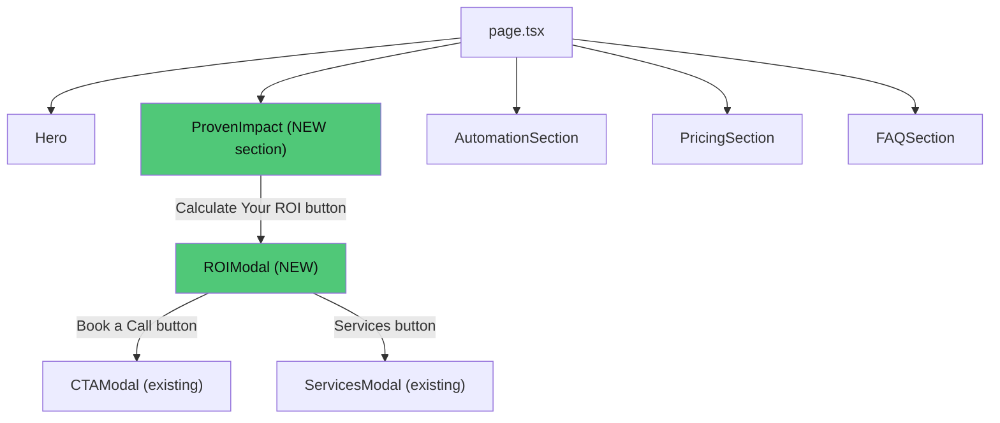

# Update ROI Calculator — Implementation Plan

**Objective:** Replace the inline ROI Calculator section with a "Proven Impact" stats grid on the landing page, and move the calculator logic into a Radix Dialog modal with conversion buttons.

---

## Architecture Overview



### Current Flow

```
page.tsx:  Hero → ROICalculator (inline section) → AutomationSection → ...
```

### Target Flow

```
page.tsx:  Hero → ProvenImpact (stats grid + trigger button) → AutomationSection → ...
                        ↓ click
                   ROIModal (calculator + conversion buttons)
                        ↓ click
                   CTAModal  or  ServicesModal
```

---

## Part 1: The UI Transition (Page Flow)

### 1A — New "Proven Impact" Stats Grid Section

**[NEW]** `components/proven-impact.tsx`

Replace the current full ROI Calculator section with a compact, high-trust stats grid.

#### Layout

```
┌──────────────────────────────────────────────────────────────┐
│                       Proven Impact                          │
│              "Results our clients actually see"              │
│                                                              │
│  ┌─────────────┐ ┌─────────────┐ ┌─────────────┐ ┌────────┐ │
│  │     96%      │ │     20%     │ │     51%     │ │  44%   │ │
│  │  Efficiency  │ │    Cost     │ │ Satisfaction│ │Revenue │ │
│  │    Gain      │ │  Reduction  │ │   Increase  │ │ Growth │ │
│  └─────────────┘ └─────────────┘ └─────────────┘ └────────┘ │
│                                                              │
│            ┌───────────────────────────────┐                 │
│            │   Calculate Your Personal ROI  │                 │
│            │      (emerald outlined)        │                 │
│            └───────────────────────────────┘                 │
└──────────────────────────────────────────────────────────────┘
```

#### Stats Data

| Stat | Value | Label | Icon |
|---|---|---|---|
| Efficiency Gain | 96% | Process Efficiency | `TrendingUp` |
| Cost Reduction | 20% | Cost Reduction | `DollarSign` |
| Satisfaction | 51% | Satisfaction Increase | `Heart` or `Smile` |
| Revenue Growth | 44% | Revenue Growth | `BarChart3` |

#### Visual Specs

- **Section background:** `#0D0D0D` (deep charcoal), matching the old ROI section.
- **Card style:** Use the existing `glass` class (frosted glass cards) with emerald accent borders.
- **Stat values:** `text-4xl sm:text-5xl font-extrabold text-white` with emerald `text-[#50C878]` for the `%` symbol.
- **Labels:** `text-sm text-[#A1A1A1] uppercase tracking-wider`.
- **Grid:** `grid grid-cols-2 lg:grid-cols-4 gap-6`.
- **Animations:** Framer Motion `whileInView` fade-in with staggered delays per card (matches existing patterns in [automation-section.tsx](file:///Users/alexdodson/cybersecurity-NordWacht_01/components/automation-section.tsx) and [glass-card.tsx](file:///Users/alexdodson/cybersecurity-NordWacht_01/components/glass-card.tsx)).

#### Trigger Button

- Centered below the grid: `"Calculate Your Personal ROI"`.
- Style: `border-2 border-[#50C878]`, transparent background, white text, `hover:bg-[#50C878]/10`.
- Uses the existing `<Button>` component with `variant="ghost"` as base + custom Tailwind overrides.
- **This button is wrapped in `<ROIModal>` as the trigger** (see Part 2).

---

### 1B — Update `page.tsx`

**[MODIFY]** [app/page.tsx](file:///Users/alexdodson/cybersecurity-NordWacht_01/app/page.tsx)

```diff
-import { ROICalculator } from "@/components/roi-calculator";
+import { ProvenImpact } from "@/components/proven-impact";
 ...
       <Hero />
-      <ROICalculator />
+      <ProvenImpact />
       <AutomationSection />
```

---

## Part 2: ROI Calculator Becomes a Modal

### 2A — New Modal Component

**[NEW]** `components/roi-modal.tsx`

A Radix Dialog wrapper following the exact same pattern as [cta-modal.tsx](file:///Users/alexdodson/cybersecurity-NordWacht_01/components/cta-modal.tsx):

#### Scaffold Structure

```
<Dialog.Root open={open} onOpenChange={setOpen}>
  <Dialog.Trigger asChild>{children}</Dialog.Trigger>
  <AnimatePresence>
    {open && (
      <Dialog.Portal forceMount>
        <Dialog.Overlay>   → motion.div with backdrop blur
        <Dialog.Content>   → motion.div with slide-up animation
          <div className="glass rounded-2xl p-6 md:p-8">
            <Dialog.Close>  → X button (top-right)
            <Dialog.Title>  → "Calculate Your Automation ROI"
            <Dialog.Description> → subtitle text

            {/* ── Calculator Body ── */}
            {/* Sliders + Output Cards (from existing roi-calculator.tsx) */}

            {/* ── Conversion Hub Footer ── */}
            <div> → Two CTA buttons </div>
          </div>
        </Dialog.Content>
      </Dialog.Portal>
    )}
  </AnimatePresence>
</Dialog.Root>
```

#### Key Differences from Inline Section

| Aspect | Inline Section (old) | Modal (new) |
|---|---|---|
| Wrapper | `<section>` tag | Radix `Dialog.Content` |
| Width | Full-width with `Container` | `max-w-3xl` centered modal |
| Background glow | Absolute positioned blobs | Remove (modal has its own overlay) |
| Section heading | Large `<h2>` with badge | Smaller `Dialog.Title` |
| Layout | Two-column grid | Two-column grid (same, but inside modal) |
| Scrolling | Page scroll | `max-h-[90vh] overflow-y-auto` on modal body |

#### What to Reuse from `roi-calculator.tsx`

The following internal components and logic should be **moved directly** into `roi-modal.tsx` (or kept in `roi-calculator.tsx` and imported):

- `AnimatedValue` component
- `RangeSlider` component
- `OutputCard` component
- Formatter functions (`formatHours`, `formatCurrency`, `formatPercent`)
- Constants (`WEEKS_PER_YEAR`, `HOURLY_RATE`, `STANDARD_WEEK`)
- `useState` hooks for `teamSize` and `manualHours`

> [!TIP]
> **Recommended approach:** Keep `roi-calculator.tsx` as the calculator UI (sliders + output cards only, no `<section>` wrapper), and import it into `roi-modal.tsx`. This keeps the calculator logic reusable.

---

### 2B — Conversion Hub Footer (Inside Modal)

Add a two-button group at the bottom of the modal, **below** the output cards:

```
┌──────────────────────────────────────────┐
│          [ Calculator content ]          │
│                                          │
│  ┌─────────────────────────────────────┐ │
│  │         Conversion Hub              │ │
│  │                                     │ │
│  │  ┌──────────────┐ ┌──────────────┐  │ │
│  │  │ Book a Call → │ │  Services    │  │ │
│  │  │ (emerald bg)  │ │ (outlined)   │  │ │
│  │  └──────────────┘ └──────────────┘  │ │
│  │                                     │ │
│  └─────────────────────────────────────┘ │
└──────────────────────────────────────────┘
```

#### Button Specs

| Button | Label | Wrapping Component | Style |
|---|---|---|---|
| **A — Primary** | "Book a Call" | `<CTAModal>` | `bg-[#50C878] text-[#0D0D0D] font-bold hover:brightness-110`, with `ArrowRight` icon |
| **B — Secondary** | "Services" | `<ServicesModal>` | `border-2 border-[#50C878] text-white hover:bg-[#50C878]/10` |

#### Modal-to-Modal Handoff

> [!IMPORTANT]
> Since both `CTAModal` and `ServicesModal` are self-contained Radix Dialogs, clicking their trigger buttons **inside** the ROI Modal will open them as new overlays. Radix stacks portals correctly by default — the ROI Modal remains beneath the new modal. No manual close-then-open logic is needed.
>
> However, if the visual stacking (double backdrop blur) is too dark, an optional enhancement is to call `setOpen(false)` on the ROI Modal's state before the child modal opens. This can be done by passing an `onClose` callback or using `Dialog.Close` as the trigger wrapper.

---

## Part 3: Implementation Steps

> **Reminder: Do not write code in this phase.**

### Step 1 — Create `proven-impact.tsx` (Stats Grid)

- Create `components/proven-impact.tsx` as a `"use client"` component.
- Define the 4-stat data array with value, label, and icon.
- Render a `<section>` with the `#0D0D0D` background, matching the old ROI section's position.
- Use a `grid grid-cols-2 lg:grid-cols-4` layout for the stat cards.
- Each card: glass styling, large stat value, muted label, emerald-tinted icon.
- Animate cards with Framer Motion `whileInView` stagger.
- Import and render `<ROIModal>` wrapping the "Calculate Your Personal ROI" button.

### Step 2 — Create `roi-modal.tsx` (Calculator Modal)

- Create `components/roi-modal.tsx` following the Radix Dialog pattern from `cta-modal.tsx`.
- Accept `children` prop as the trigger element.
- Move or import the calculator UI from `roi-calculator.tsx`:
  - `AnimatedValue`, `RangeSlider`, `OutputCard` sub-components.
  - Formatters and constants.
  - `useState` for slider values.
- Set modal width: `max-w-3xl` to accommodate the two-column calculator grid.
- Add `max-h-[90vh] overflow-y-auto` for mobile scrolling.
- Add the two-button "Conversion Hub" footer at the bottom:
  - `<CTAModal><Button>Book a Call</Button></CTAModal>`
  - `<ServicesModal><Button>Services</Button></ServicesModal>`

### Step 3 — Update `page.tsx`

- Remove `ROICalculator` import.
- Add `ProvenImpact` import.
- Replace `<ROICalculator />` with `<ProvenImpact />` in the JSX.

### Step 4 — Clean Up (Optional)

- If all calculator logic is moved into `roi-modal.tsx`, delete `roi-calculator.tsx`.
- If keeping `roi-calculator.tsx` as a reusable inner component, remove its `<section>` wrapper and `Container` — it should just render the sliders + output cards.
- Remove the `.roi-slider` CSS from `globals.css` **only if** the slider styles are no longer needed (they likely still are).

### Step 5 — Verify

- `npm run build` — zero errors.
- `npm run dev` — check browser:
  - Stats grid renders below Hero with 4 cards.
  - "Calculate Your Personal ROI" button opens the ROI Modal.
  - Sliders work inside the modal, output values update live.
  - "Book a Call" inside modal opens CTAModal correctly.
  - "Services" inside modal opens ServicesModal correctly.
  - Mobile: modal scrolls, stats grid stacks 2×2.

---

## File Summary

| Action | File | Description |
|---|---|---|
| **NEW** | `components/proven-impact.tsx` | 4-card stats grid section with ROI Modal trigger button |
| **NEW** | `components/roi-modal.tsx` | Radix Dialog wrapping the ROI calculator + conversion buttons |
| **MODIFY** | `app/page.tsx` | Swap `<ROICalculator />` → `<ProvenImpact />` |
| **MODIFY or DELETE** | `components/roi-calculator.tsx` | Either refactor to remove section wrapper, or delete if logic moves fully into `roi-modal.tsx` |

No new dependencies. No global state. No changes to `CTAModal` or `ServicesModal`.

---

## Verification Checklist

- [ ] `npm run build` — zero TypeScript / build errors
- [ ] Stats grid shows 4 cards: 96% Efficiency, 20% Cost Reduction, 51% Satisfaction, 44% Revenue
- [ ] "Calculate Your Personal ROI" button opens the ROI Modal
- [ ] Modal sliders work, outputs update in real-time
- [ ] "Book a Call" button (modal footer) opens CTAModal
- [ ] "Services" button (modal footer) opens ServicesModal
- [ ] No double-darkened backdrop when opening a child modal
- [ ] Mobile layout: stats grid is 2×2, modal is scrollable
- [ ] `ArrowRight` icon animates on hover of "Book a Call" button
- [ ] Emerald accent consistency (`#50C878`) across all new elements
